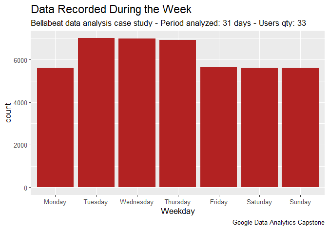

# BELLABEAT  DATA  ANALYSIS  CASE  STUDY 
<br> Author: Monalisa Murmu 
<br> Date: May 22, 2024

###  _**<p align="center">How Can a Wellness Technology Company Play It Smart?</p>**_
<a id="top"></a>

<div align="center">
  
</div>
<br>
<div align="center">
  <p style="font-size:24px; font-weight:bold;">
    <a href="#ask">ASK</a> >
    <a href="#prepare">PREPARE</a> >
    <a href="#process">PROCESS</a> >
    <a href="#analyze">ANALYZE</a> >
    <a href="#share">SHARE</a> >
    <a href="#act">ACT</a>
  </p>
</div>

## INTRODUCTION

[Bellabeat](https://bellabeat.com) is a high-tech company that manufactures health-focused products for women.
Founded in 2013 by Urška Sršen and Sando Mur, Bellabeat has grown rapidly and quickly positioned itself as a wellness-tech company for women.

By 2016, Bellabeat had opened offices around the world and launched multiple products, including an app (Bellabeat), a wellness tracker (Leaf), a wellness smartwatch (Time), a smart water bottle (Spring) and a subscription-based membership program (Bellabeat) that provides users 24/7 access to fully personalised guidance on having a healthy lifestyle.

The CEO, Urška Sršen believes that analyzing smart device fitness data could help unlocking new growth opportunities for the company and they have the potential to become a larger player in the global smart device market. So, she has asked the marketing analytics team to focus on a Bellabeat product and analyze smart device usage data in order to gain insight into how people are already using their smart devices. 

With the analysis report, she would like high-level recommendations for how these trends can inform Bellabeat marketing strategy.

## <a id="ask"></a>ASK 

### Business Task 
> _Analyze the usage of data from FitBit Fitness Tracker to uncover insights on user behaviour and preferences, and to provide data-driven recommendations for improving product features, marketing strategies, and user engagement._

* **Primary stakeholders:** 
    * _Urška Sršen_, Bellabeat’s cofounder & Chief Creative Officer and, 
    * _Sando Mur_, Bellabeat’s cofounder & Mathematician 
* **Secondary stakeholders:** 
    * Bellabeat marketing analytics team, a team of data analysts

## PREPARE

**Data Source:** [FitBit Fitness Tracker Data](https://www.kaggle.com/datasets/arashnic/fitbit) (CC0: Public Domain, dataset made available through [Mobius](https://www.kaggle.com/arashnic))

The dataset has 18 CSV files representing 18 datasets but of these datasets, I will be using 5. The data also follow a ROCCC approach:

1. Reliability: These datasets were generated by 30 FitBit respondents who consented to the submission of personal fitness tracker data to a distributed survey via Amazon Mechanical Turk.

2. Original: The data is from 30 eligible Fitbit users who consented to the submission of personal tracker data, which includes information about daily activity, steps, and heart rate that can be used to explore users’ habits.

3. Comprehensive: The data is stored in long format with each ID having data in multiple rows and it includes minute-level output for physical activity, heart rate, and sleep monitoring. The sample size being small presents a bias as a larger sample size would have been more representative of the population and the lack of demographic information like gender, age, and location prevents us from confirming if the data accurately represents the population.

4. Current: The dataset having been collected between March, 2016 and May, 2016 makes it outdated for the current analysis as the users habit may be different now.

5. Cited: Furberg, R., Brinton, J., Keating, M., & Ortiz, A. (2016). Crowd-sourced Fitbit datasets 03.12.2016-05.12.2016 [Data set]. Zenodo. https://doi.org/10.5281/zenodo.53894

⚠️ **Limitations in the dataset:**

  1. According to the central limit theorem, a sample size of at least 30 is generally considered sufficient for the sample mean to approximate a normal distribution, allowing us to use the t-test for statistical analysis. However, a larger sample size would provide more reliable and robust insights, reducing the margin of error and increasing the confidence in the results.
  
  2. Further investigation with `n_distinct()` to check for unique user IDs showed a user count of 33 users data from daily activity and hourly steps, 24 from sleep, 14 from heart rate seconds and only 8 from weight. Also, the timeframe stated as 03.12.2016 to 05.12.2016 showed only 31 days upon verification which concludes that the data does not pass the integrity and credibility test.

  3. Out of the 8 users data for weight, 5 entered their weight manually, while 3 used a connected wifi device (e.g., wifi scale) to record their weight.
  
  4. Most data is recorded from Tuesday to Thursday. Interestingly, the sleep data, which mirrors this trend, raises questions about the data's comprehensiveness for accurate analysis.
  
  
## PROCESS 

### **Why R and Tableau?**

We have opted for _R in RStudio_ for our data analysis due to its ability to provide in-depth statistical analysis, data manipulation, and generating complex insights from the data. <br> On the other hand for visualization we are using _Tableau_, another powerful tool employed for creating interactive and visually appealing dashboards, making it easier to explore and present the findings effectively to both internal and external stakeholders. <br> Together, they provide a comprehensive approach to analyzing and visualizing data.

### 1. The following CSV files were used for analysis:
```r  
dailyActivity_merged.csv
sleepDay_merged.csv
weightLogInfo_merged.csv
hourlySteps_merged.csv
heartrate_seconds_merged.csv
```
### 2. Examine the data of three main tables: `daily_activity`, `sleep_day` & `weight` and, check for NA as well as duplicate values and, eliminate them:
```r
dim(daily_activity)
dim(sleep_day)
dim(weight)

sum(is.na(daily_activity))
sum(is.na(sleep_day))                 # We will leave the NA. 
sum(is.na(weight))                    # 65 NA values belongs to "Fat" data of different dates.

sum(duplicated(daily_activity))
sum(duplicated(sleep_day))
sum(duplicated(weight))              

sleep_day <- sleep_day[!duplicated(sleep_day), ]      # Eliminate the 3 duplicate values in the table `sleep_day`
```
### 3. Add a new column for the weekdays:
```r
daily_activity <- daily_activity %>% mutate(Weekday = weekdays(as.Date(ActivityDate, "%m/%d/%Y")))
```
### 4. Check for the uniqueness of 30 users using `n_distinct()`:
```r
n_distinct(daily_activity$Id)
n_distinct(hourly_steps$Id)
n_distinct(sleep_day$Id)
```
The table has **33** unique users' data from `daily_activity`, **24** from `sleep_day` and only **8** from `weight`.

### 5. Check how the data was recorded in the `weight` table:
```r
weight %>% 
  filter(IsManualReport == "True") %>% 
  group_by(Id) %>% 
  summarise("Manual Weight Report"=n()) %>%            # 5 users manually reported the weight whereas,
  distinct()                                           # 3 users reported it with a connected device - wifi connected scale
```
This leads to the question that, how often do users record their data? To have additional insights, we used `ggplot()` to plot a bar graph which shows us that the users mostly record their data from Tuesdays to Thursdays.




iv. ANALYZE 

v. SHARE 

vi. ACT
