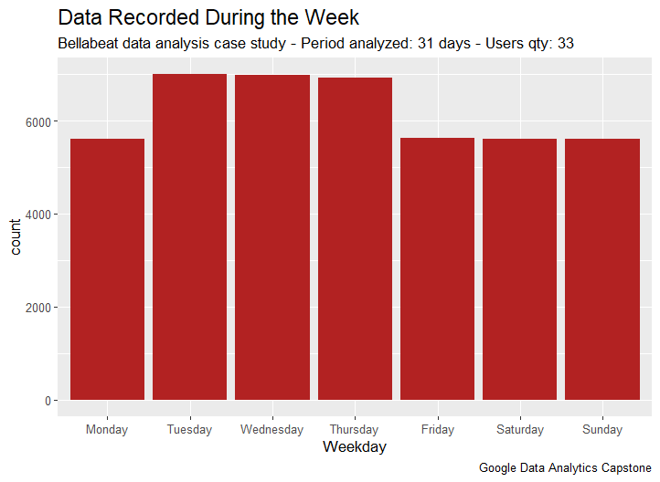
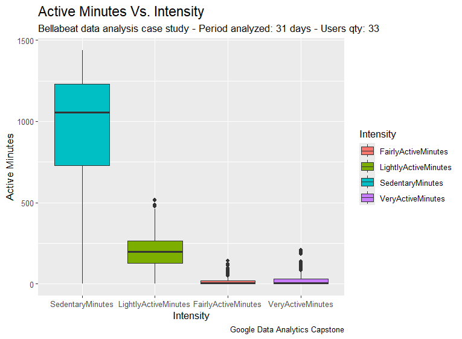
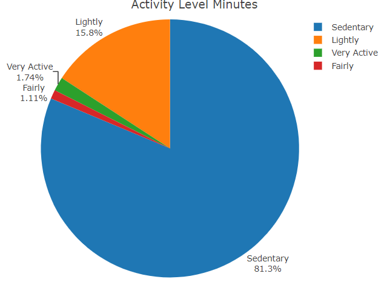
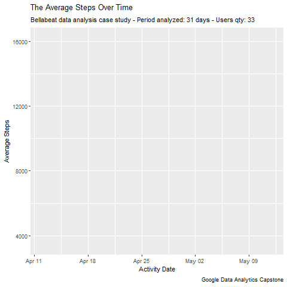
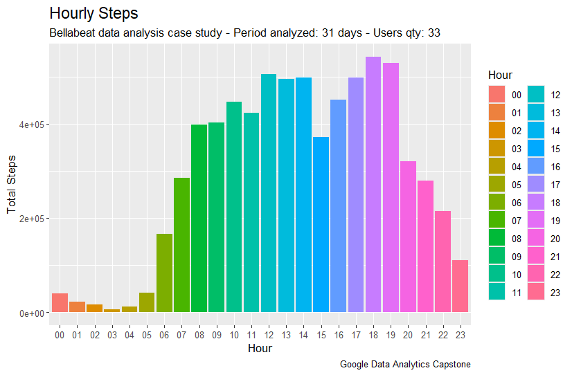
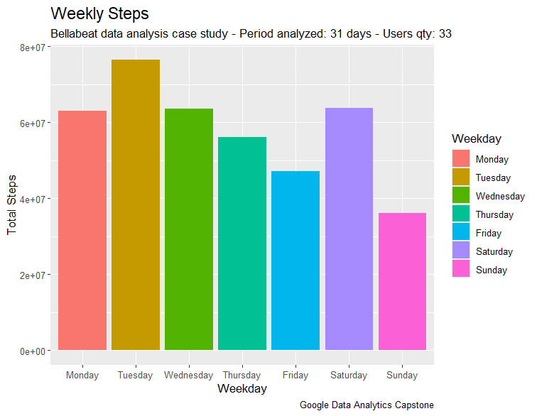
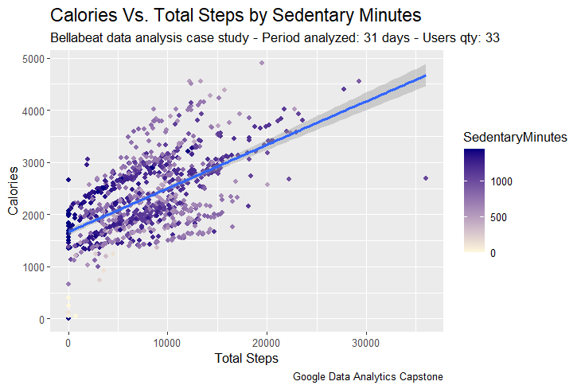
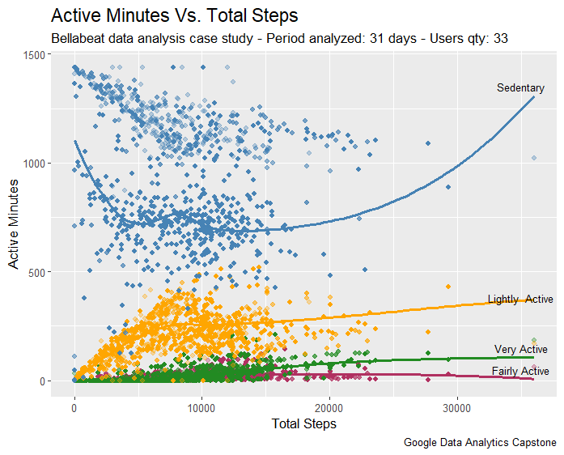
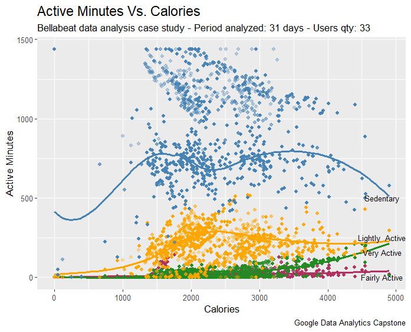

# BELLABEAT  DATA  ANALYSIS  CASE  STUDY 
<br> Author: Monalisa Murmu 
<br> Date: May 22, 2024

###  _**<p align="center">How Can a Wellness Technology Company Play It Smart?</p>**_
<a id="top"></a>

<div align="center">
  
</div>
<br>
<div align="center">
  <p style="font-size:24px; font-weight:bold;">
    <a href="#ask">ASK</a> >
    <a href="#prepare">PREPARE</a> >
    <a href="#process">PROCESS</a> >
    <a href="#analyze">ANALYZE</a> >
    <a href="#share">SHARE</a> >
    <a href="#act">ACT</a>
  </p>
</div>

## INTRODUCTION

[Bellabeat](https://bellabeat.com) is a high-tech company that manufactures health-focused products for women.
Founded in 2013 by Urška Sršen and Sando Mur, Bellabeat has grown rapidly and quickly positioned itself as a wellness-tech company for women.

By 2016, Bellabeat had opened offices around the world and launched multiple products, including an app (Bellabeat), a wellness tracker (Leaf), a wellness smartwatch (Time), a smart water bottle (Spring) and a subscription-based membership program (Bellabeat) that provides users 24/7 access to fully personalised guidance on having a healthy lifestyle.

The CEO, Urška Sršen believes that analyzing smart device fitness data could help unlocking new growth opportunities for the company and they have the potential to become a larger player in the global smart device market. So, she has asked the marketing analytics team to focus on a Bellabeat product and analyze smart device usage data in order to gain insight into how people are already using their smart devices. 

With the analysis report, she would like high-level recommendations for how these trends can inform Bellabeat marketing strategy.

## ASK 

### Business Task 
> _Analyze the usage of data from FitBit Fitness Tracker to uncover insights on user behaviour and preferences, and to provide data-driven recommendations for improving product features, marketing strategies, and user engagement._

* **Primary stakeholders:** 
    * _Urška Sršen_, Bellabeat’s cofounder & Chief Creative Officer and, 
    * _Sando Mur_, Bellabeat’s cofounder & Mathematician 
* **Secondary stakeholders:** 
    * Bellabeat marketing analytics team, a team of data analysts

## PREPARE

**Data Source:** [FitBit Fitness Tracker Data](https://www.kaggle.com/datasets/arashnic/fitbit) (CC0: Public Domain, dataset made available through [Mobius](https://www.kaggle.com/arashnic))

The dataset has 18 CSV files representing 18 datasets but of these datasets, I will be using 5. The data also follow a ROCCC approach:

1. Reliability: These datasets were generated by 30 FitBit respondents who consented to the submission of personal fitness tracker data to a distributed survey via Amazon Mechanical Turk.

2. Original: The data is from 30 eligible Fitbit users who consented to the submission of personal tracker data, which includes information about daily activity, steps, and heart rate that can be used to explore users’ habits.

3. Comprehensive: The data is stored in long format with each ID having data in multiple rows and it includes minute-level output for physical activity, heart rate, and sleep monitoring. The sample size being small presents a bias as a larger sample size would have been more representative of the population and the lack of demographic information like gender, age, and location prevents us from confirming if the data accurately represents the population.

4. Current: The dataset having been collected between March, 2016 and May, 2016 makes it outdated for the current analysis as the users habit may be different now.

5. Cited: Furberg, R., Brinton, J., Keating, M., & Ortiz, A. (2016). Crowd-sourced Fitbit datasets 03.12.2016-05.12.2016 [Data set]. Zenodo. https://doi.org/10.5281/zenodo.53894

⚠️ **Limitations in the dataset:**

  1. According to the central limit theorem, a sample size of at least 30 is generally considered sufficient for the sample mean to approximate a normal distribution, allowing us to use the t-test for statistical analysis. However, a larger sample size would provide more reliable and robust insights, reducing the margin of error and increasing the confidence in the results.
  
  2. Further investigation with `n_distinct()` to check for unique user IDs showed a user count of 33 users data from daily activity and hourly steps, 24 from sleep, 14 from heart rate seconds and only 8 from weight. Also, the timeframe stated as 03.12.2016 to 05.12.2016 showed only 31 days upon verification which concludes that the data does not pass the integrity and credibility test.

  3. Out of the 8 users data for weight, 5 entered their weight manually, while 3 used a connected wifi device (e.g., wifi scale) to record their weight.
  
  4. Most data is recorded from Tuesday to Thursday. Interestingly, the sleep data, which mirrors this trend, raises questions about the data's comprehensiveness for accurate analysis.
  
  
## PROCESS 

### **Why R and Tableau?**

We have opted for _R in RStudio_ for our data analysis due to its ability to provide in-depth statistical analysis, data manipulation, and generating complex insights from the data. <br> On the other hand for visualization we are using _Tableau_, another powerful tool employed for creating interactive and visually appealing dashboards, making it easier to explore and present the findings effectively to both internal and external stakeholders. <br> Together, they provide a comprehensive approach to analyzing and visualizing data.

### 1. The following CSV files were used for analysis:
```r  
dailyActivity_merged.csv
sleepDay_merged.csv
weightLogInfo_merged.csv
hourlySteps_merged.csv
heartrate_seconds_merged.csv
```
### 2. Examine the data of three main tables: `daily_activity`, `sleep_day` & `weight` and, check for NA as well as duplicate values and, eliminate them:
```r
dim(daily_activity)
dim(sleep_day)
dim(weight)

sum(is.na(daily_activity))
sum(is.na(sleep_day))                 # We will leave the NA. 
sum(is.na(weight))                    # 65 NA values belongs to "Fat" data of different dates.

sum(duplicated(daily_activity))
sum(duplicated(sleep_day))
sum(duplicated(weight))              

sleep_day <- sleep_day[!duplicated(sleep_day), ]      # Eliminate the 3 duplicate values in the table `sleep_day`
```
### 3. Add a new column for the weekdays:
```r
daily_activity <- daily_activity %>% mutate(Weekday = weekdays(as.Date(ActivityDate, "%m/%d/%Y")))
```
### 4. Check for the uniqueness of 30 users using `n_distinct()`:
```r
n_distinct(daily_activity$Id)
n_distinct(hourly_steps$Id)
n_distinct(sleep_day$Id)
```
The table has **33** unique users' data from `daily_activity`, **24** from `sleep_day` and only **8** from `weight`.

### 5. Check how the data was recorded in the `weight` table:
```r
weight %>% 
  filter(IsManualReport == "True") %>% 
  group_by(Id) %>% 
  summarise("Manual Weight Report"=n()) %>%            # 5 users manually reported the weight whereas,
  distinct()                                           # 3 users reported it with a connected device - wifi connected scale
```
This leads to a question that, how often do users record their data? <br>
To have additional insights, we used `ggplot()` to plot a bar graph which shows us that the users mostly record their data from Tuesdays to Thursdays. We can also notice that even though Mondays and Fridays are weekdays, there has been significantly lesser data recordings.

<div align="center">

</div>

### 6. Merge the three tables into a single data frame:
```r
merged_v1 <- merge(daily_activity, sleep_day, by = c("Id"), all=TRUE)
merged_data <- merge(merged_v1, weight, by = c("Id"), all=TRUE)
```

## ANALYZE 

<div align="left">
  <p style="font-size:14px;">
    <a href="#distribution-of-active-minutes">Distribution of Active Minutes</a> |
    <a href="#total-steps-taken">Total Steps Taken</a> |
    <a href="#statistical-summary">Statistical Summary</a> |
    <a href="#interesting-findings">Interesting Findings</a>
  </p>
</div>

###  1. Distribution of Active Minutes:  <a id="distribution-of-active-minutes"></a>
<div align="center">


</div>

With the help of a boxplot and a pie chart, we can see a very clear distribution of the four categories of active minutes: <br>
* **81.3% or 12 to 20 hours in sedentary**, <br>
* **15.8% or 2 to 4.5 hours lightly active**, <br>
* **1.11% fairly active** and, <br>
* **1.74% very active**. 

> _The American Heart Association and the World Health Organization recommend at least 150 minutes of moderate-intensity activity or 75 minutes of vigorous activity, or a combination of both, each week._ 

This means we need to have a daily goal of 21.4 minutes being fairly active or 10.7 minutes being very active.

```r
active_users <- daily_activity %>%
  filter(FairlyActiveMinutes >= 21.4 | VeryActiveMinutes>=10.7) %>% 
  group_by(Id) %>% 
  count(Id) 

n_distinct(active_users)
```
As per our study, **30 users met fairly active minutes or very active minutes**.

### 2. Total Steps taken:  <a id="total-steps-taken"></a>
<div align="center">

</div>

This animated line graph shows that users walked similar amount of steps during the month analyzed, with some pronounced peaks and minimums, which shows an unsteady trend. 
<br>

<div align="center">


</div>

The bar graphs above shows that the users take the **most steps between 5 PM to 7 PM** and **12 PM to 2 PM** for hourly steps and, **most steps on Tuesdays** for weekly steps. 

### 3. Statistical Summary:  <a id="statistical-summary"></a>
 Check for Mean, Median, Min, Max of the dataset(s)
```r
merged_data %>%
  dplyr::select(TotalSteps,
                TotalDistance,
                VeryActiveMinutes,
                FairlyActiveMinutes,
                LightlyActiveMinutes,
                SedentaryMinutes,
                Calories,
                TotalMinutesAsleep,
                TotalTimeInBed,
                WeightPounds,
                BMI
  ) %>%
  summary()
```
Average steps taken to burn 2103 calories in average is 9373. Average weight is 139.6 pound (63 kg)  with average BMI, 24.42. Users tend to spend on an average 12 hours a day in sedentary, 4 hours being lightly active and, just 41 minutes a day being fairly to very active. Users sleep for 7 hours on an average per day. The average heartrate is 77 bpm.

### 4. Interesting Findings:  <a id="interesting-findings"></a>

```r
ggplot(data=daily_activity, aes(x=TotalSteps, y = Calories, color=SedentaryMinutes)) + 
  geom_point() + 
  labs(title="Calories Vs. Total Steps by Sedentary Minutes", 
       caption= "Google Data Analytics Capstone",
       subtitle = "Bellabeat data analysis case study - Period analyzed: 31 days - Users qty: 33", x="Total Steps") +
  theme(plot.title = element_text(size = 15), 
        plot.subtitle = element_text(size = 11)) +
  stat_smooth(method=lm) +
  scale_color_gradient(low="cornsilk", high="navy")
```
<div align="center">

</div>

We can see in the above plot that, there are **some users who are in sedentary taking 10,000 steps yet they were able to burn over 1500 to 3000 calories !!**

> _According to the Lancet Public Health study on daily steps and all-cause mortality, there is a decrease in the risk of mortality among adults aged 60 years and older with increasing number of steps per day until 6000–8000 steps per day and among adults younger than 60 years until 8000–10,000 steps per day._ <br>

<div align="center">


</div>

It is to be noted in the above two graphs that most data is concentrated on users who take about **2500 to 15000 steps a day** and, users who burn **1500 to 3000 calories a day**. These users spent between **8 to 11.5 hours in sedentary**, **5 hours in lightly active** and, **1 to 2 hour for fairly and very active**.


## SHARE 

### [Bellabeat Data-Analysis Dashboard](https://public.tableau.com/views/BELLABEATDATA-ANALYSISDASHBOARD/Dashboard?:language=en-US&:sid=&:redirect=auth&:display_count=n&:origin=viz_share_link)
### [Bellabeat Case Study Presentation in Tableau](https://public.tableau.com/views/BELLABEATCASESTUDYPRESENTATION/Presenation?:language=en-US&:sid=&:redirect=auth&:display_count=n&:origin=viz_share_link)


## ACT

Conclusion based on our analysis:

* Sedentary behavior accounts for a substantial 81% of users' daily active minutes. On average, users spend 12 to 20 hours a day being sedentary, 2 to 4.5 hours being lightly active, and just 30 minutes being fairly to very active.

* 54% of users who logged their sleep data spent 55 minutes awake in bed before falling asleep.

* Most steps are taken by users between 12 PM to 2 PM and 5 PM to 7 PM. Sedentary users take fewer steps and burn 1500 to 3000 calories, while more active users take more steps but burn a similar amount of calories.

Marketing recommendations to expand globally:

* To enhance data accuracy, we recommend that users utilize a WiFi-connected scale instead of manually entering their weight.

* Help users reduce sedentary time by suggesting alternative activities and delivering articles on the health benefits of shorter sedentary periods through pop-up notifications.

* The marketing team should stress the health benefits of exercise, highlighting how the watch helps users track progress, set daily goals, and receive activity reminders. By promoting its "Stay Active, Stay Healthy" feature, users will be encouraged to complete their daily activity rings and maintain a healthy lifestyle.


## References:
1. American Heart Association. "What Exercise Is Right for Me?" _Go Red Get Fit_, 2024. [click here](https://www.heart.org/en/healthy-living/go-red-get-fit/what-exercise-is-right-for-me#:~:text=Get%20at%20least%20150%20minutes%20per%20week%20of%20moderate%2Dintensity%20aerobic%20activity%20or%2075%20minutes%20per%20week%20of%20vigorous%20aerobic%20activity%2C%20or%20a%20combination%20of%20both%2C%20preferably%20spread%20throughout%20the%20week.)

2. World Health Organization (WHO). "Physical Activity." _Be Active_, 2024. [click here](https://www.who.int/initiatives/behealthy/physical-activity#:~:text=Should%20do%20at%20least%20150%20minutes%20of%20moderate%2Dintensity%20physical%20activity%20throughout%20the%20week%2C%20or%20do%20at%20least%2075%20minutes%20of%20vigorous%2Dintensity%20physical%20activity%2C%20or%20an%20equivalent%20combination%20of%20both.)

3. Paluch, Amanda E., et al. "Steps per day and all-cause mortality in middle-aged adults in the Coronary Artery Risk Development in Young Adults study." _The Lancet Public Health_, vol. 6, no. 11, 2021, pp. e787-e794. [click here](https://www.thelancet.com/journals/lanpub/article/PIIS2468-2667%2821%2900302-9/fulltext#seccestitle140:~:text=There%20was%20progressively%20lower%20risk%20of%20mortality%20among%20adults%20aged%2060%20years%20and%20older%20until%20about%206000%E2%80%938000%20steps%20per%20day%20and%20among%20adults%20younger%20than%2060%20years%20until%20about%208000%E2%80%9310%E2%80%88000%20steps%20per%20day.)

4. Banach, M., Lewek, J., Surma, S., Penson, P. E., Sahebkar, A., Martin, S. S., Bajraktari, G., Henein, M. Y., Reiner, Ž., Bielecka-Dąbrowa, A., Bytyçi, I., et al. "The association between daily step count and all-cause and cardiovascular mortality: a meta-analysis." _European Journal of Preventive Cardiology_, vol. 30, no. 18, Dec. 2023, pp. 1975-1985. [click here](https://academic.oup.com/eurjpc/article/30/18/1975/7226309?login=false#:~:text=This%20meta%2Danalysis%20demonstrates%20a%20significant%20inverse%20association%20between%20daily%20step%20count%20and%20all%2Dcause%20mortality%20and%20CV%20mortality%20with%20more%20the%20better%20over%20the%20cut%2Doff%20point%20of%203867%20steps/day%20for%20all%2Dcause%20mortality%20and%20only%202337%20steps%20for%20CV%20mortality.)

